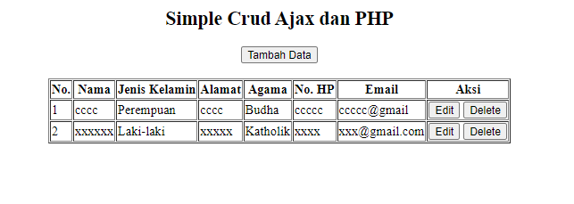

# ajax sederhana 1
> pembelajaran jquery tentang ajax

<ol>
<li>html 5</li>
<li>php 7++ (7.3)</li>
<li>jquery 3++ (3.6)</li>
<li>mysql 5</li>
</ol>



## step 1
buat database seperti dibawah ini :

```sql
CREATE DATABASE `ajaxsederhana1`;
USE `ajaxsederhana1`;

CREATE TABLE `mahasiswa` (
`IdMhsw` int(11) NOT NULL PRIMARY KEY AUTO_INCREMENT,
`Nama` varchar(150),
`JenisKelamin` varchar(20),
`Alamat` text,
`Agama` varchar(30),
`NoHp` varchar(15),
`Email` varchar(150)
);
```

## step 2
dowload jquery  linkya <a href="https://code.jquery.com/jquery-3.6.0.min.js">https://code.jquery.com/jquery-3.6.0.min.js</a>


## step 3
buat folder ajaxsederhana1 didalam file htdocs, yang nantinya file file selanjutnya ditaruh didalamnya (folder: ajaxsederhana1)

> c:> xampp > htdocs > ajaxsederhana1

## step 4
buat file dengan nama koneksi.php
```php
<?php
 //koneksi ke database 
 $server = "localhost";
  $user = "root";
 $pass = "";
 $dbname = "ajaxsederhana1";

 $koneksi = mysqli_connect($server,$user,$pass,$dbname);
 if(mysqli_connect_errno()){
  echo "Koneksi database gagal".mysqli_connect_error();
 }
?>
```
## step 5
buat file dengan nama index.php
```html
<!DOCTYPE html>
<html>
<head>
    <title>Simple Crud Ajax</title>
    <!-- jquery -->
    <!--/ jquery -->
    <!-- jquery command -->
    <!--/ jquery command -->
    <!-- create function  -->
    <!--/ create function  -->
</head>
<body>
    <div align="center">
        <h2>Simple Crud Ajax dan PHP</h2>
        <div id="contentData"></div>
    </div>
</body>
</html>
```

hubungkan jquery.js dengan index.php
`<script type="text/javascript" src="jquery.js"></script>`

kemudian buat fungsi dengan nama loadData():

```js
  function loadData() {
            $.ajax({
                url: 'data-mahasiswa.php',
                type: 'get',
                success: function(data) {
                    $('#contentData').html(data);
                },
                error: function (data,status) {
                    $('#contentData').html(status);
                }
            });
        }
```

kemudian buat perintah jquery
```js
  $(document).ready(function(e) {
    //--------------------pembuka jquery   
    // code  perintah jquery
    //--------------------penutup jquery 
  })
```

lalu jalankan fungsi yang tadi kita buat `loadData()`
```js
  loadData()
```


## step 6
buat file dengan nama data-mahasiswa.php
```html
<button id="addButton" class="btn btn-primary">Tambah Data</button>
<br>
<br>
<table border="1">
    <thead>
        <tr>
            <th>No.</th>
            <th>Nama</th>
            <th>Jenis Kelamin</th>
            <th>Alamat</th>
            <th>Agama</th>
            <th>No. HP</th>
            <th>Email</th>
            <th>Aksi</th>
        </tr>
    </thead>
    <tbody>
            <tr>
                <td>1</td>
                <td>roy</td>
                <td>pria</td>
                <td>jl.kenangan</td>
                <td>konghuchu</td>
                <td>086776xxxxx</td>
                <td>xxxxx@gmail.com</td>
                <td>
                    <button>edit</button>
                    <button>hapus</button>
                </td>
            </tr>
    </tbody>
</table>
```
kemudian ubah beberapa data didalamnya seperti ini:
```php
<button id="addButton" class="btn btn-primary">Tambah Data</button>
<br>
<br>
<table border="1">
    <thead>
        <tr>
            <th>No.</th>
            <th>Nama</th>
            <th>Jenis Kelamin</th>
            <th>Alamat</th>
            <th>Agama</th>
            <th>No. HP</th>
            <th>Email</th>
            <th>Aksi</th>
        </tr>
    </thead>
    <tbody>
        <?php
   include "koneksi.php";
   $no=1;
   $query=mysqli_query($koneksi, "SELECT * FROM Mahasiswa ORDER BY IdMhsw DESC") or die(mysqli_error($koneksi));
   while ($result=mysqli_fetch_array($query)) {
    ?>
            <tr>
                <td>
                    <?php echo $no++; ?>
                </td>
                <td>
                    <?php echo $result['Nama']; ?>
                </td>
                <td>
                    <?php echo $result['JenisKelamin']; ?>
                </td>
                <td>
                    <?php echo $result['Alamat']; ?>
                </td>
                <td>
                    <?php echo $result['Agama']; ?>
                </td>
                <td>
                    <?php echo $result['NoHp']; ?>
                </td>
                <td>
                    <?php echo $result['Email']; ?>
                </td>
                <td>
                    <button id="EditButton" value="<?php echo $result['IdMhsw']; ?>">Edit</button>
                    <button id="DeleteButton" value="<?php echo $result['IdMhsw']; ?>">Delete</button>
                </td>
            </tr>
            <?php
   }
  ?>
    </tbody>
</table>
```

## step 7
buat fungsi di perintah jquery
```js
  //Load form add
            $("#contentData").on("click", "#addButton", function() {
                $.ajax({
                    url: 'form-add.php',
                    type: 'get',
                    success: function(data) {
                        $('#contentData').html(data);
                    }
                });
            });
```

## step 8
buat file form-add.php
```html
<form method="POST" id="formAdd">
    <table>
        <tr>
            <td>Nama</td>
            <td>
                <input type="text" name="Nama" id="Nama" required="" />
            </td>
        </tr>
        <tr>
            <td>Jenis Kelamin</td>
            <td>
                <label>
                    <input type="radio" name="JenisKelamin" id="JenisKelamin" value="Laki-laki" required="" />Laki-laki</label>
                <label>
                    <input type="radio" name="JenisKelamin" id="JenisKelamin" value="Perempuan" required="" />Perempuan</label>
            </td>
        </tr>
        <tr>
            <td>Alamat</td>
            <td>
                <textarea name="Alamat" id="Alamat" required=""></textarea>
            </td>
        </tr>
        <tr>
            <td>Agama</td>
            <td>
                <select name="Agama" id="Agama" required="">
                    <option disabled="" selected="">-Pilih-</option>
                    <option value="Islam">Islam</option>
                    <option value="Kristen">Kristen</option>
                    <option value="Katholik">Katholik</option>
                    <option value="Budha">Budha</option>
                    <option value="Hindhu">Hindhu</option>
                    <option value="Konghucu">Konghucu</option>
                    <option value="Lain-lain">Lain-lain</option>
                </select>
            </td>
        </tr>
        <tr>
            <td>No. HP</td>
            <td>
                <input type="text" name="NoHP" id="NoHP" required="" />
            </td>
        </tr>
        <tr>
            <td>Email</td>
            <td>
                <input type="email" name="Email" id="Email" required="" />
            </td>
        </tr>
        <tr>
            <td></td>
            <td>
                <input type="submit" name="simpan" id="simpan" value="Simpan" />
                <button id="cancelButton" type="button">Batal</button>
            </td>
        </tr>
    </table>
</form>
```

## step 9
buat perintah jquery untuk cancel
```js
  //button batal
  $("#contentData").on("click", "#cancelButton", function() {
    loadData();
    });
```

##  step 10
buat perintah jquery untuk simpan data
```js

//simpan data mahasiswa
 $("#contentData").on("submit", "#formAdd", function(e) {
   e.preventDefault();
   $.ajax({
   url: 'service.php?action=save',
   type: 'post',
   data: $(this).serialize(),
   success: function(data) {
   alert(data);
   loadData();
   }
   });
});
```

## step 11
buat file dengan nama service.php
```php
<?php
include "koneksi.php";
switch ($_GET['action'])
{
    case 'save':
        echo "simpan kuy";
    break;
    case 'edit':
        echo "edit kuy";
    break;
    case 'delete':
       echo "delete kuy";
    break;
}
?>
```
kemudian di didalam case simpan ubah seperti ini:
```php
$Nama = $_POST['Nama'];
        $JenisKelamin = $_POST['JenisKelamin'];
        $Alamat = $_POST['Alamat'];
        $Agama = $_POST['Agama'];
        $NoHP = $_POST['NoHP'];
        $Email = $_POST['Email'];

        $query = mysqli_query($koneksi, "INSERT INTO Mahasiswa(Nama, JenisKelamin, Alamat, Agama, NoHp, Email) VALUES('$Nama', '$JenisKelamin', '$Alamat', '$Agama', '$NoHP', '$Email')");
        if ($query)
        {
            echo "Simpan Data Berhasil";
        }
        else
        {
            echo "Simpan Data Gagal :" . mysqli_error($koneksi);
        }
```
## step 12
```js
    //form edit by id
            $("#contentData").on("click", "#EditButton", function() {
                var IdMhsw = $(this).attr("value");
                $.ajax({
                    url: 'form-edit.php',
                    type: 'get',
                    data: {
                        IdMhsw: IdMhsw
                    },
                    success: function(data) {
                        $('#contentData').html(data);
                    }
                });
            });
```
## step 13
buat file form-edit.php
```html
    <form method="POST" id="formEdit">
        <table>
            <tr>
                <td>Nama</td>
                <td>
                    <input type="hidden" name="IdMhsw" id="IdMhsw" required="" value="" />
                    <input type="text" name="Nama" id="Nama" required="" />
                </td>
            </tr>
            <tr>
                <td>Jenis Kelamin</td>
                <td>
                    <label>
                        <input type="radio" name="JenisKelamin" id="JenisKelamin" value="Laki-laki" required="" />Laki-laki</label>
                    <label>
                        <input type="radio" name="JenisKelamin" id="JenisKelamin" value="Perempuan" required=""  />Perempuan</label>
                </td>
            </tr>
            <tr>
                <td>Alamat</td>
                <td>
                    <textarea name="Alamat" id="Alamat" required="">
                    
                    </textarea>
                </td>
            </tr>
            <tr>
                <td>Agama</td>
                <td>
                    <select name="Agama" id="Agama" required="">
                        <option disabled="" selected="">-Pilih-</option>
                        <option value="Islam" )  >Islam</option>
                        <option value="Kristen"  )  >Kristen</option>
                        <option value="Katholik"  )  >Katholik</option>
                        <option value="Budha" )  >Budha</option>
                        <option value="Hindhu"  )  >Hindhu</option>
                        <option value="Konghucu"  )  >Konghucu</option>
                        <option value="Lain-lain"  )  >Lain-lain</option>
                    </select>
                </td>
            </tr>
            <tr>
                <td>No. HP</td>
                <td>
                    <input type="text" name="NoHP" id="NoHP" required="" value="" />
                </td>
            </tr>
            <tr>
                <td>Email</td>
                <td>
                    <input type="email" name="Email" id="Email" required="" value="" />
                </td>
            </tr>
            <tr>
                <td></td>
                <td>
                    <input type="submit" name="simpan" id="simpan" value="Simpan" />
                    <button type="button" id="cancelButton">Batal</button>
                </td>
            </tr>
        </table>
    </form>
```
kemudian ubah seperti ini
```php

<?php
 include "koneksi.php";
 $IdMhsw=$_GET['IdMhsw'];
 $query=mysqli_query($koneksi, "SELECT * FROM Mahasiswa WHERE IdMhsw='$IdMhsw'") or die(mysqli_error($koneksi));
 $result=mysqli_fetch_array($query);
?>
    <form method="POST" id="formEdit">
        <table>
            <tr>
                <td>Nama</td>
                <td>
                    <input type="hidden" name="IdMhsw" id="IdMhsw" required="" value="<?php echo $result['IdMhsw']; ?>" />
                    <input type="text" name="Nama" id="Nama" required="" value="<?php echo $result['Nama']; ?>" />
                </td>
            </tr>
            <tr>
                <td>Jenis Kelamin</td>
                <td>
                    <label>
                        <input type="radio" name="JenisKelamin" id="JenisKelamin" value="Laki-laki" required="" <?php if($result[ 'JenisKelamin']=="Laki-laki" ) echo "checked"; ?> />Laki-laki</label>
                    <label>
                        <input type="radio" name="JenisKelamin" id="JenisKelamin" value="Perempuan" required="" <?php if($result[ 'JenisKelamin']=="Perempuan" ) echo "checked"; ?> />Perempuan</label>
                </td>
            </tr>
            <tr>
                <td>Alamat</td>
                <td>
                    <textarea name="Alamat" id="Alamat" required="">
                        <?php echo $result['Alamat']; ?>
                    </textarea>
                </td>
            </tr>
            <tr>
                <td>Agama</td>
                <td>
                    <select name="Agama" id="Agama" required="">
                        <option disabled="" selected="">-Pilih-</option>
                        <option value="Islam" <?php if($result[ 'Agama']=="Islam" ) echo "selected"; ?>>Islam</option>
                        <option value="Kristen" <?php if($result[ 'Agama']=="Kristen" ) echo "selected"; ?>>Kristen</option>
                        <option value="Katholik" <?php if($result[ 'Agama']=="Katholik" ) echo "selected"; ?>>Katholik</option>
                        <option value="Budha" <?php if($result[ 'Agama']=="Budha" ) echo "selected"; ?>>Budha</option>
                        <option value="Hindhu" <?php if($result[ 'Agama']=="Hindhu" ) echo "selected"; ?>>Hindhu</option>
                        <option value="Konghucu" <?php if($result[ 'Agama']=="Konghucu" ) echo "selected"; ?>>Konghucu</option>
                        <option value="Lain-lain" <?php if($result[ 'Agama']=="Lain-lain" ) echo "selected"; ?>>Lain-lain</option>
                    </select>
                </td>
            </tr>
            <tr>
                <td>No. HP</td>
                <td>
                    <input type="text" name="NoHP" id="NoHP" required="" value="<?php echo $result['NoHp']; ?>" />
                </td>
            </tr>
            <tr>
                <td>Email</td>
                <td>
                    <input type="email" name="Email" id="Email" required="" value="<?php echo $result['Email']; ?>" />
                </td>
            </tr>
            <tr>
                <td></td>
                <td>
                    <input type="submit" name="simpan" id="simpan" value="Simpan" />
                    <button type="button" id="cancelButton">Batal</button>
                </td>
            </tr>
        </table>
    </form>
```
## step 14 
buat perintah jquery seperti ini :
```js
   //edit data 
    $("#contentData").on("submit", "#formEdit", function(e) {
    e.preventDefault();
    $.ajax({
    url: 'service.php?action=edit',
    type: 'post',
    data: $(this).serialize(),
    success: function(data) {
    alert(data);
    loadData();
     }
     });
   });
```

## step 15
ubah case edit seperti ini
```php
$IdMhsw = $_POST['IdMhsw'];
$Nama = $_POST['Nama'];
$JenisKelamin = $_POST['JenisKelamin'];
$Alamat = $_POST['Alamat'];
$Agama = $_POST['Agama'];
$NoHP = $_POST['NoHP'];
$Email = $_POST['Email'];

$query = mysqli_query($koneksi, "UPDATE Mahasiswa SET Nama='$Nama', JenisKelamin='$JenisKelamin', Alamat='$Alamat', Agama='$Agama', NoHp='$NoHP', Email='$Email' WHERE IdMhsw='$IdMhsw'");
if ($query)
{
echo "Edit Data Berhasil";
}
 else
{
echo "Edit Data Gagal :" . mysqli_error($koneksi);
}
```

## step 16
buat perintah jquery seperti ini:
```js
   //hapus data
            $("#contentData").on("click", "#DeleteButton", function() {
                var IdMhsw = $(this).attr("value");
                $.ajax({
                    url: 'service.php?action=delete',
                    type: 'post',
                    data: {
                        IdMhsw: IdMhsw
                    },
                    success: function(data) {
                        alert(data);
                        loadData();
                    }
                });
            });
        })
```

## step 17
ubah case delete seperti ini:
```php
 $IdMhsw = $_POST['IdMhsw'];
        $query = mysqli_query($koneksi, "DELETE FROM Mahasiswa WHERE IdMhsw='$IdMhsw'");
        if ($query)
        {
            echo "Hapus Data Berhasil";
        }
        else
        {
            echo "Hapus Data Gagal :" . mysqli_error($koneksi);
        }
```

<center>
<h2>finished for 1</h2>
</center>

`buatlah kopi dan bakarlah roko, kemudian duduk dan simetriskan kaki kalian, kencangkan celana dalam, dan jangan sampai burung kalian lepas, tarik napas dan buang perlahan, kemudian isaplah roko dengan santai. begitupun dengan kenangan yang larut dalam kehangatan saat bersama, seruputlah kopi karena kopi mengandung cafein yang bisa membuat kita lebih segar saat melihat matanya yang penuh penyesalan.`


